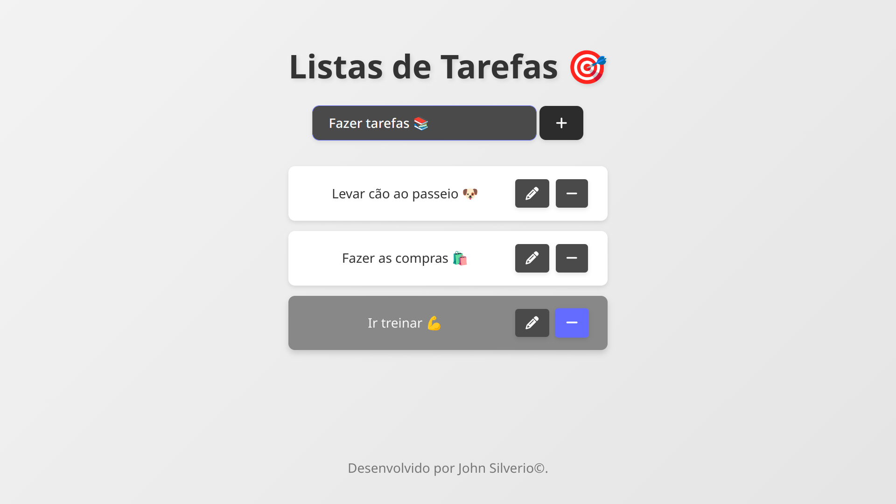

# myTaskList

O **myTaskList** é um projeto de lista de tarefas desenvolvido usando Vite. Ele permite adicionar, editar e remover tarefas de uma lista interativa.

<div align="center">  </div>

## Requisitos

- **Node.js**: Certifique-se de ter o Node.js instalado em sua máquina.
- **npm**: O Node Package Manager é necessário para instalar as dependências e executar scripts.

## Instalação

Siga os passos abaixo para configurar e iniciar o projeto:

1. **Clone o Repositório**:
    ```bash
    git clone https://github.com/seu-usuario/myTaskList.git
    ```
2. **Navegue até o Diretório do Projeto**:
    ```bash
    cd myTaskList
    ```
3. **Instale as Dependências**:
    ```bash
    npm install
    ```

## Execução do Projeto

Para iniciar o projeto em modo de desenvolvimento, use o seguinte comando:

```bash
npm run dev
```